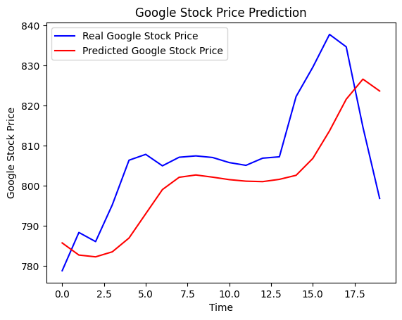

# StockNet: Predicting Google Stock Prices Using Recurrent Neural Networks

This project demonstrates the application of a Recurrent Neural Network (RNN) to predict Google's stock prices in 2017 based on previous stock data. The model leverages Long Short-Term Memory (LSTM) layers to capture time dependencies within stock price data and produce a prediction.

## Project Overview

The goal of this project is to predict the stock price of Google in 2017 using historical stock prices. An RNN is trained on a sequence of stock prices and used to forecast the stock price for future days. This project helps in understanding how deep learning can be applied to time-series data, like stock prices.

## Problem Solved

Stock prices exhibit complex patterns due to market fluctuations. Predicting future stock prices based on historical data can assist investors in making informed decisions. This project aims to provide a model that helps predict future prices based on past data, even in fluctuating markets.

## Key Features

- **Recurrent Neural Network (RNN):** Utilizes LSTM layers to capture time dependencies and trends within stock price data.
- **Time-Series Data Processing:** Historical stock prices are preprocessed and structured into sequences to train the model.
- **Dropout Regularization:** Dropout is employed to prevent overfitting and ensure better generalization to unseen data.
- **Prediction Performance:** The model forecasts future prices by learning patterns from past trends, achieving reasonable predictions.

## Model Architecture

The RNN model was constructed using the following components:
- **LSTM Layers:** Four LSTM layers with 50 units each are used to capture long-term dependencies in stock price data.
- **Dropout Layers:** Dropout layers with a rate of 0.2 are added after each LSTM layer to prevent overfitting.
- **Dense Layer:** A fully connected layer with a single output unit to predict the stock price for the next time step.
- **Optimizer:** The Adam optimizer is used with a mean squared error loss function.

## Results

After training the RNN for 100 epochs with a batch size of 32, the following results were observed:
- The model was able to capture the general trend of stock price movements.
- Below is a visualization of the real stock price vs. the predicted stock price:



## Future Improvements

Several enhancements can be made to improve the model's performance:
- **Data Augmentation:** Incorporating additional stock data such as trading volume and external economic factors could improve accuracy.
- **Hyperparameter Tuning:** Further tuning of batch size, learning rate, and number of LSTM units might improve prediction results.
- **Advanced Architectures:** Explore more advanced architectures like Bidirectional LSTMs and GRUs for better time-series forecasting.
- **Transfer Learning:** Utilize pre-trained models to enhance the generalization capabilities of the network.

## Dataset

The dataset used for training and testing the RNN can be found on Kaggle: [Google Stock Price Dataset](https://www.kaggle.com/muhammadqasim/google-stock-price-data).

To download the dataset programmatically, use the following code snippet:
```python
!pip install kaggle
from kaggle.api.kaggle_api_extended import KaggleApi
api = KaggleApi()
api.authenticate()
api.dataset_download_files('your-username/google-stock-price-dataset', path='data/', unzip=True)
